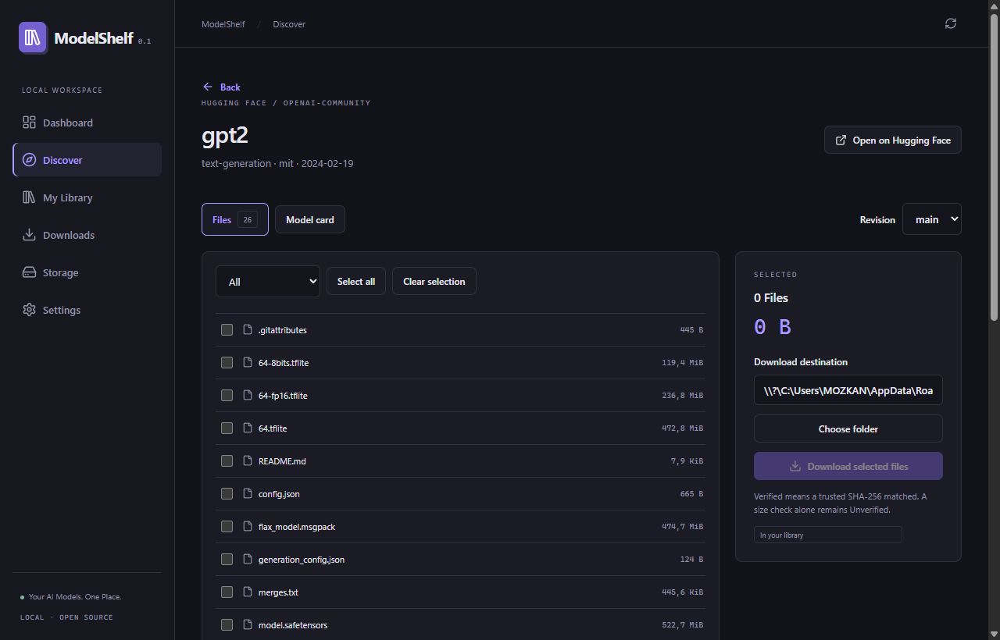
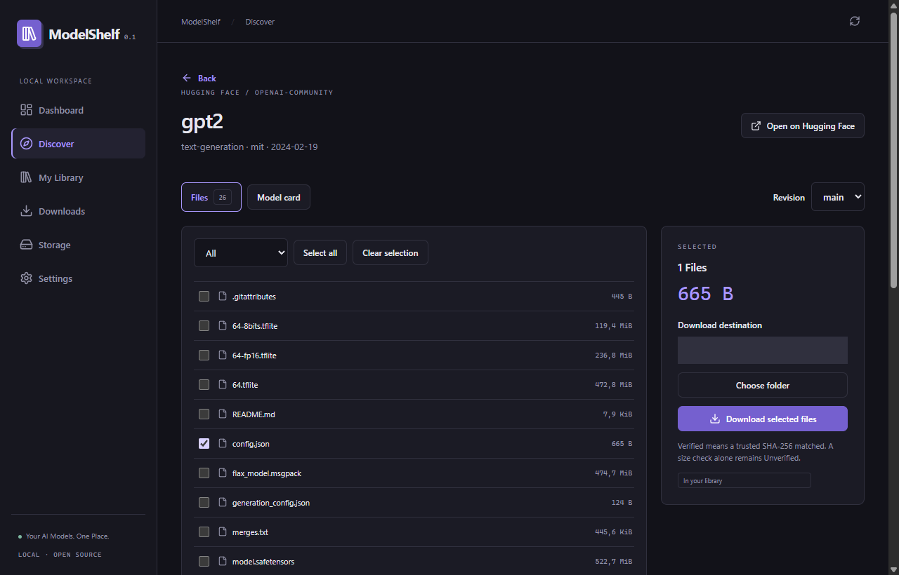

# ModelShelf

**Your AI Models. One Place.**

A local-first desktop application for discovering Hugging Face models, selecting repository files,
downloading them into your own folders, and organizing existing model files without moving them.

ModelShelf is an **experimental 0.1.0 Windows MVP**. It is a model manager, not an inference engine.
It exists to make large downloads and scattered model directories easier to understand without terminal commands.
There is no ModelShelf account or cloud service.

## What works

- Tauri 2 / Rust desktop application with React, TypeScript, dark/light/system themes and English/Turkish UI.
- Public Hugging Face search, task filters, repository details, revisions, inert model cards and nested file selection.
- Persistent SQLite download queue with bounded concurrency, pause/resume/retry/cancel and per-file progress.
- Conditional HTTP range continuation: checkpointed bytes are reused only after local prefix and remote identity checks.
- Size validation, streaming SHA-256 and explicit Verified / Unverified / Corrupted labels.
- Local library with favorites, tags, notes, format/search filters, grid/list views and native folder opening.
- Index existing files or directories in place. Removing an external entry leaves source files untouched.
- Native-confirmed deletion restricted to recorded managed files.
- Multiple storage directories, free space checks, logical usage and duplicate analysis.
- OS credential storage for optional Hugging Face tokens; informational CPU/RAM/GPU detection on Windows.
- Automated recovery and filesystem safety tests. See [validation status](docs/implementation-status.md).

## Screenshots




These captures show the native Windows application and real Hugging Face metadata. The local destination
path is masked in the repository screenshot for privacy.

## Installation

Reference platform: **Windows 10/11 x64 with WebView2**. Build artifacts, when produced locally,
are under `target/release/bundle/nsis`. Run the NSIS `.exe` to install for the current user.
No Node, Rust, Python, Docker or Hugging Face CLI is required on an end user's computer.

There is no published GitHub release URL yet. Do not download a package from an assumed project address.
The initial installer is unsigned. Linux and macOS packaging are on the roadmap.

## Develop and build

Install Node.js 22+, pnpm 11.24.0, stable Rust MSVC and the Windows C++ build tools.

```powershell
pnpm install --frozen-lockfile
pnpm dev
```

Create the production installer with `pnpm build`.
See [development and packaging](docs/development.md) for all prerequisites and validation commands.

## A first download

1. Open **Discover**, search `openai-community/gpt2`, and open the repository.
2. Select `config.json` for a small test, or select the actual model files you need.
3. Choose a destination and start the download.
4. Follow progress in **Downloads**. Completed jobs appear in **My Library**.
5. Restart the app: the queue, settings and library are persisted locally.

Use **Import file** or **Index folder** to include existing models. These actions do not move or copy originals.
Gated models require the provider's own license/access procedure and a legitimately authorized token.

## Providers and reliability

Hugging Face is the implemented provider. Transfers use its HTTPS resolve endpoint, pinned to a commit,
including HTTP-compatible Xet bridge downloads. Native Xet chunk acceleration is not implemented.
Resume support depends on the actual response: unchanged strong ETag, exact range and verified local checkpoint.
If a server returns a full body instead, the file restarts and reports zero reused bytes.
See [download behavior](docs/downloads.md) for recovery guarantees and limitations.

## Security and privacy

No telemetry. Tokens use OS credential storage, not SQLite. Untrusted repository HTML and scripts never execute.
External library entries do not grant ownership. Managed deletion requires confirmation and path validation.
The local library works offline; discovery and provider authentication require internet access.
Read [security design](docs/security.md) and [vulnerability reporting](SECURITY.md).

## Current limitations

- Pre-release, not yet validated across all Windows hardware, very large repositories, or multi-gigabyte failure scenarios.
- Symlinks/junctions are rejected by import/write/delete operations; shared Hugging Face cache indexing is deferred.
- Managed output publication requires a filesystem supporting hardlinks (normally NTFS on Windows).
- Cancellation retains partial files for retry; automatic cleanup and drive relocation are deferred.
- Hashes computed locally without trusted provider hashes remain Unverified.
- Storage numbers are logical lengths, not allocated disk blocks. Duplicate hashes are recorded observations, not deletion advice.
- README is displayed as plain text. The UI does not infer runtime compatibility or automatically select dependencies.
- Launch-at-login, copy-on-import, signed updates, Linux/macOS installers and native Xet acceleration are deferred.
- Provider errors and native confirmation dialogs currently use English; primary navigation and page controls support Turkish.
- A maintainer must set the public repository, issue and security contact URLs before publication.

## Contribute

Start with [CONTRIBUTING.md](CONTRIBUTING.md), [architecture](docs/architecture.md),
[implementation checklist](docs/implementation-status.md), [roadmap](docs/roadmap.md) and
[code of conduct](CODE_OF_CONDUCT.md). Provider interfaces are separated from download and storage logic.
No stars, download counts or contributor statistics are claimed for this new project.

## License

[MIT](LICENSE), copyright ModelShelf contributors.
